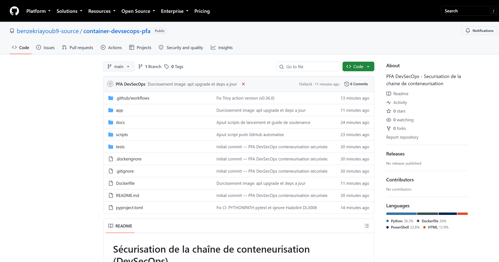
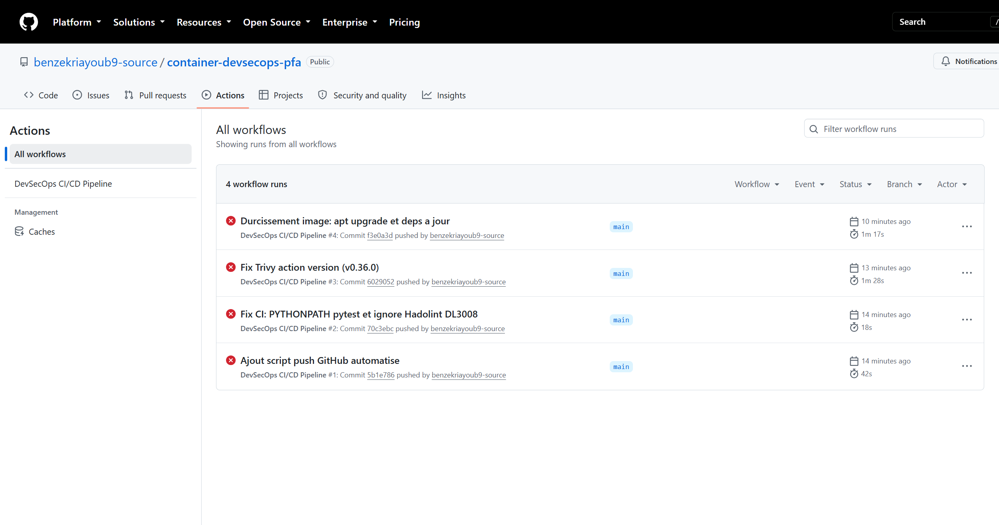
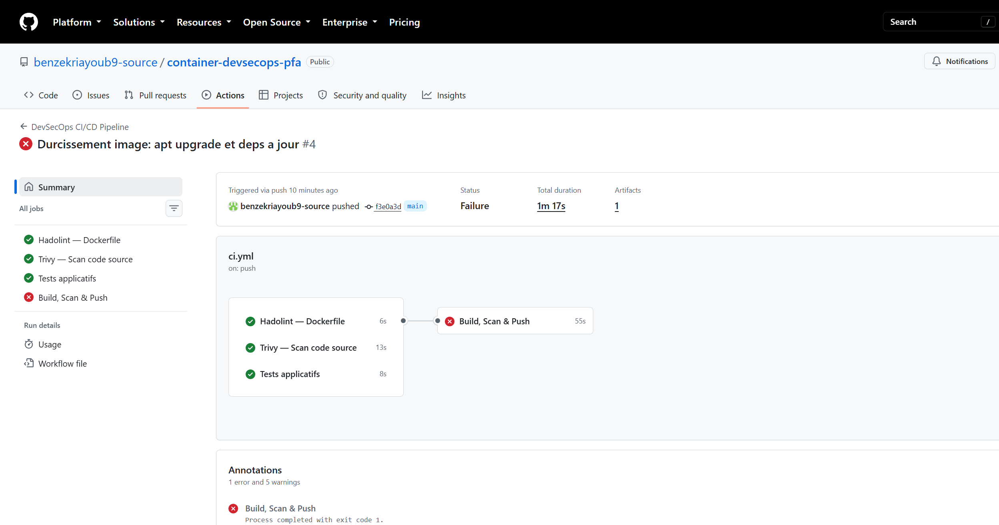
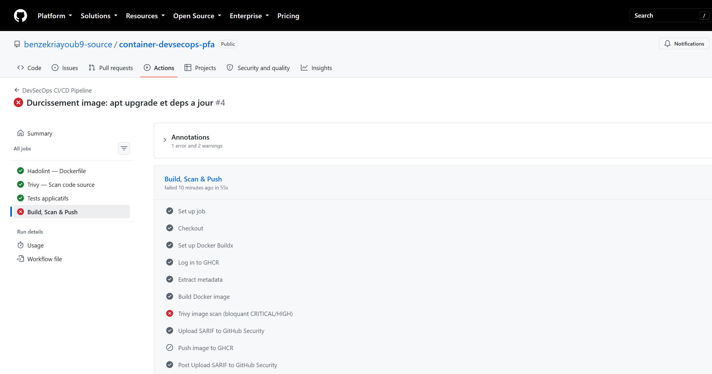
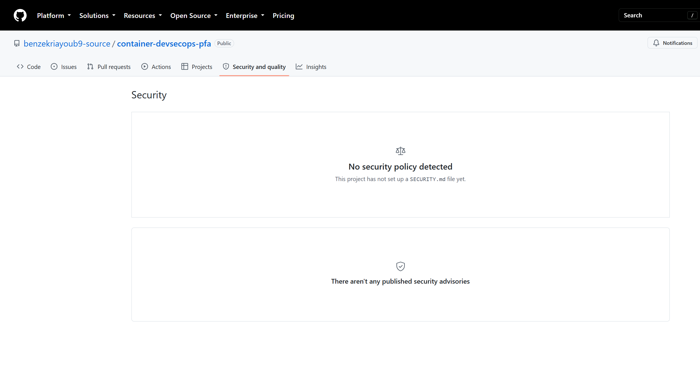

<div align="center">


<br><br>

# RAPPORT DE PROJET DE FIN D'ANNÉE (PFA)

## Sécurisation de la chaîne de conteneurisation (DevSecOps)

<br>

**Établissement :** EMSI — École Marocaine des Sciences de l'Ingénieur  
**Filière :** 4ᵉ année CIR — Cycle Ingénieur Réseaux  
**Année universitaire :** 2025–2026

<br>

| | |
|---|---|
| **Réalisé par :** | Ayoub Benzekri |
| **Encadré par :** | [Nom de l'encadrant pédagogique] |
| **Date de soutenance :** | Vendredi 12 septembre 2026 |
| **Dépôt GitHub :** | [container-devsecops-pfa](https://github.com/benzekriayoub9-source/container-devsecops-pfa) |

<br>

*« Première école d'ingénieurs privée au Maroc — Reconnue par l'État »*

</div>

---

<div style="page-break-after: always;"></div>

## Remerciements

Je tiens à exprimer ma profonde gratitude à toutes les personnes qui ont contribué, de près ou de loin, à la réalisation de ce Projet de Fin d'Année.

Je remercie tout d'abord **l'EMSI — École Marocaine des Sciences de l'Ingénieur**, et plus particulièrement le corps professoral de la filière **CIR (Cycle Ingénieur Réseaux)**, pour la qualité de la formation dispensée et pour m'avoir permis d'acquérir les compétences techniques et méthodologiques nécessaires à ce projet.

Mes remerciements s'adressent également à **[Nom de l'encadrant pédagogique]**, mon encadrant pédagogique, pour son accompagnement, ses conseils avisés et sa disponibilité tout au long de l'élaboration de ce travail.

Je remercie aussi l'ensemble de mes camarades de promotion pour les échanges enrichissants et l'entraide mutuelle durant cette année universitaire.

Enfin, je adresse mes remerciements les plus sincères à ma famille pour son soutien indéfectible, sa patience et ses encouragements constants.

---

<div style="page-break-after: always;"></div>

## Résumé

Ce Projet de Fin d'Année s'inscrit dans le domaine du **DevSecOps** et porte sur la **sécurisation de la chaîne de conteneurisation** d'une application web. L'objectif est de démontrer l'intégration de la sécurité dès les premières phases du cycle de développement (*Shift Left Security*), conformément aux bonnes pratiques de l'industrie.

Le projet comprend le développement d'une application web Python/Flask durcie, la construction d'une image Docker multi-étapes avec utilisateur non-root, et la mise en place d'un pipeline CI/CD GitHub Actions automatisant les contrôles de sécurité via **Hadolint** (linting Dockerfile) et **Trivy** (SCA, détection de secrets, scan d'image). Une politique de blocage stricte sur les vulnérabilités CRITICAL et HIGH empêche le déploiement d'artefacts non conformes.

Les résultats obtenus confirment le bon fonctionnement de la chaîne DevSecOps : les contrôles en amont (Hadolint, Trivy FS, tests) passent avec succès, tandis que la gate post-build bloque correctement la publication d'une image contenant des vulnérabilités HIGH dans l'OS Debian de base.

**Mots-clés :** DevSecOps, Docker, CI/CD, GitHub Actions, Hadolint, Trivy, Shift Left, conteneurisation, sécurité applicative, supply chain.

---

<div style="page-break-after: always;"></div>

## Abstract

This Final Year Project focuses on **DevSecOps** and the **securing of the containerization pipeline** for a web application. The goal is to demonstrate the integration of security from the earliest stages of the development lifecycle (*Shift Left Security*), in accordance with industry best practices.

The project includes the development of a hardened Python/Flask web application, the construction of a multi-stage Docker image with a non-root user, and the implementation of a GitHub Actions CI/CD pipeline automating security controls via **Hadolint** (Dockerfile linting) and **Trivy** (SCA, secret detection, image scanning). A strict blocking policy on CRITICAL and HIGH vulnerabilities prevents the deployment of non-compliant artifacts.

**Keywords:** DevSecOps, Docker, CI/CD, GitHub Actions, Hadolint, Trivy, Shift Left, containerization, application security, supply chain.

---

<div style="page-break-after: always;"></div>

## Table des matières

1. [Introduction](#1-introduction)
   - 1.1 [Contexte et problématique](#11-contexte-et-problématique)
   - 1.2 [Objectifs du projet](#12-objectifs-du-projet)
   - 1.3 [Périmètre et livrables](#13-périmètre-et-livrables)
   - 1.4 [Architecture globale](#14-architecture-globale)
2. [Analyse des risques DevSecOps](#2-analyse-des-risques-devsecops)
   - 2.1 [Méthodologie d'analyse](#21-méthodologie-danalyse)
   - 2.2 [Cartographie des risques](#22-cartographie-des-risques)
   - 2.3 [Analyse détaillée par couche](#23-analyse-détaillée-par-couche)
   - 2.4 [Matrice risque / contrôle](#24-matrice-risque--contrôle)
3. [Implémentation technique avec Hadolint et Trivy](#3-implémentation-technique-avec-hadolint-et-trivy)
   - 3.1 [Stack technique](#31-stack-technique)
   - 3.2 [Application web sécurisée](#32-application-web-sécurisée)
   - 3.3 [Dockerfile durci](#33-dockerfile-durci)
   - 3.4 [Pipeline GitHub Actions](#34-pipeline-github-actions)
   - 3.5 [Justification des choix d'outils](#35-justification-des-choix-doutils)
4. [Résultats du pipeline](#4-résultats-du-pipeline)
   - 4.1 [Environnement d'exécution](#41-environnement-dexécution)
   - 4.2 [Résultats des exécutions CI/CD](#42-résultats-des-exécutions-cicd)
   - 4.3 [Interprétation de l'échec du scan image](#43-interprétation-de-léchec-du-scan-image)
   - 4.4 [Validation locale](#44-validation-locale)
   - 4.5 [Indicateurs de conformité DevSecOps](#45-indicateurs-de-conformité-devsecops)
5. [Conclusion générale](#5-conclusion-générale)
6. [Annexes](#6-annexes)
7. [Bibliographie et webographie](#7-bibliographie-et-webographie)

---

<div style="page-break-after: always;"></div>

## 1. Introduction

### 1.1 Contexte et problématique

La conteneurisation avec **Docker** a profondément transformé les pratiques de déploiement logiciel dans l'industrie. Elle offre portabilité, reproductibilité et accélération des cycles de livraison (*Time-to-Market*). Cependant, cette adoption massive s'accompagne d'une **surface d'attaque élargie** : images non durcies, dépendances vulnérables, secrets exposés dans le code source, et pipelines CI/CD insuffisamment sécurisés.

Historiquement, la sécurité informatique était traitée en fin de cycle de développement — une approche qualifiée de **« bolting on security »** (ajout de la sécurité en dernière minute). Cette méthode s'est révélée coûteuse, lente et inefficace : corriger une vulnérabilité en production coûte en moyenne **10 à 100 fois plus cher** que de la détecter en phase de développement (source : NIST, *The Economic Impacts of Inadequate Infrastructure for Software Testing*).

Le mouvement **DevSecOps** propose une alternative structurante : **intégrer la sécurité dès les premières étapes** du cycle DevOps, selon le principe du **Shift Left Security**. L'objectif n'est plus de « sécuriser après », mais de « sécuriser pendant » — à chaque commit, à chaque build, à chaque déploiement.

Ce Projet de Fin d'Année, réalisé dans le cadre de la filière **CIR (Cycle Ingénieur Réseaux)** à l'**EMSI**, vise à concevoir et mettre en œuvre une chaîne de conteneurisation sécurisée, de bout en bout, en s'appuyant sur des outils open source reconnus par l'industrie.

### 1.2 Objectifs du projet

| ID | Objectif | Critère de réussite |
|----|----------|---------------------|
| **O1** | Développer une application web minimaliste et sécurisée | En-têtes OWASP, config durcie, tests passants |
| **O2** | Construire une image Docker durcie (*hardening*) | Multi-stage, non-root, HEALTHCHECK |
| **O3** | Automatiser les contrôles de sécurité via GitHub Actions | Pipeline complet Hadolint + Trivy |
| **O4** | Mettre en place des *quality gates* bloquantes | Blocage sur CRITICAL et HIGH |
| **O5** | Documenter et justifier chaque choix de sécurité | README, ARCHITECTURE.md, rapport PFA |

### 1.3 Périmètre et livrables

**Périmètre inclus :**
- Application web Python/Flask conteneurisée ;
- `Dockerfile` multi-étapes avec utilisateur non-root ;
- Pipeline CI/CD GitHub Actions (6 étapes de contrôle) ;
- Documentation technique complète ;
- Dépôt GitHub public avec historique de commits.

**Hors périmètre :**
- Orchestration Kubernetes et NetworkPolicies ;
- Gestion avancée des secrets (HashiCorp Vault) ;
- Génération de SBOM (CycloneDX/SPDX) ;
- Conformité SLSA Level 2+.

**Livrables produits :**

```
container-devsecops-pfa/
├── README.md                    # Documentation principale
├── Dockerfile                   # Image durcie multi-stage
├── .github/workflows/ci.yml     # Pipeline DevSecOps
├── app/                         # Application Flask
├── tests/                       # Tests automatisés
├── docs/
│   ├── ARCHITECTURE.md          # Justifications techniques
│   ├── SOUTENANCE.md            # Guide de présentation
│   ├── RAPPORT_PFA.md           # Ce document
│   └── assets/                  # Captures d'écran et logo
└── scripts/                     # Scripts de lancement
```

### 1.4 Architecture globale

Le schéma suivant illustre le flux DevSecOps implémenté :

```
[Développeur] → [Git Push] → [GitHub Actions]
                                    │
                    ┌───────────────┼───────────────┐
                    ▼               ▼               ▼
              [Hadolint]      [Trivy FS]      [Tests pytest]
                    │               │               │
                    └───────────────┼───────────────┘
                                    ▼
                            [Docker Build]
                                    ▼
                            [Trivy Image Scan]
                                    ▼
                         [Push GHCR] (si main + scan OK)
```

Chaque commit sur les branches `main` ou `develop`, ainsi que chaque Pull Request vers `main`, déclenche automatiquement l'ensemble des contrôles.

**Figure 1 — Dépôt GitHub du projet**



*Capture d'écran du dépôt GitHub `benzekriayoub9-source/container-devsecops-pfa` montrant la structure du projet, les 6 commits et la répartition des langages (Python 38,3 %, Dockerfile 26 %, PowerShell 22,8 %, HTML 12,9 %).*

---

<div style="page-break-after: always;"></div>

## 2. Analyse des risques DevSecOps

### 2.1 Méthodologie d'analyse

L'analyse des risques s'appuie sur une approche structurée combinant plusieurs référentiels reconnus :

| Référentiel | Application dans ce projet |
|-------------|---------------------------|
| **STRIDE** | Classification des menaces par catégorie |
| **OWASP Top 10** | Risques applicatifs web |
| **CIS Docker Benchmark** | Bonnes pratiques conteneurisation |
| **NIST SSDF** | Secure Software Development Framework |
| **SLSA** | Supply chain security |

### 2.2 Cartographie des risques

| ID | Menace | Composant | Impact | Probabilité | Niveau |
|----|--------|-----------|--------|-------------|--------|
| **R1** | Vulnérabilités dans les dépendances Python (SCA) | `requirements.txt` | Élevé | Élevée | **Critique** |
| **R2** | CVE dans l'image de base Debian (OS) | `Dockerfile` | Élevé | Élevée | **Critique** |
| **R3** | Exécution du conteneur en root | `Dockerfile` | Élevé | Moyenne | **Élevé** |
| **R4** | Secrets commités (.env, clés API) | Code source | Critique | Moyenne | **Critique** |
| **R5** | Dockerfile non conforme aux bonnes pratiques | `Dockerfile` | Moyen | Élevée | **Moyen** |
| **R6** | Attaques XSS / Clickjacking | Application Flask | Moyen | Moyenne | **Moyen** |
| **R7** | Déploiement d'une image vulnérable | Pipeline CI/CD | Élevé | Moyenne | **Élevé** |
| **R8** | Absence de traçabilité des artefacts | Registry GHCR | Moyen | Faible | **Moyen** |

### 2.3 Analyse détaillée par couche

#### 2.3.1 Couche application (Flask)

**Risques :**
- Injection XSS et clickjacking (R6) ;
- Fuite de la `SECRET_KEY` si codée en dur ;
- Mode debug activé en production ;
- Attaques DoS via upload massif.

**Mesures de mitigation :**

| Mesure | Implémentation | Référence |
|--------|----------------|-----------|
| En-têtes HTTP sécurisés | `@app.after_request` | OWASP Secure Headers |
| SECRET_KEY externalisée | `os.environ.get("SECRET_KEY")` | OWASP ASVS V2 |
| Limite upload | `MAX_CONTENT_LENGTH = 1 Mo` | OWASP ASVS V12 |
| Serveur production | Gunicorn (pas Flask dev server) | CIS Benchmark |

#### 2.3.2 Couche conteneur (Docker)

**Risques :**
- CVE dans les packages OS Debian (R2) ;
- Conteneur exécuté en root (R3) ;
- Outils de compilation présents en runtime ;
- Absence de healthcheck.

**Mesures de mitigation :**

| Mesure | Implémentation | Référence |
|--------|----------------|-----------|
| Multi-stage build | Builder + Runtime séparés | CIS 4.1 |
| Image minimale | `python:3.12-slim-bookworm` | CIS 4.2 |
| Utilisateur non-root | `appuser` UID 10001 | CIS 4.1 |
| Mise à jour OS | `apt-get upgrade` en runtime | CIS 4.2 |
| HEALTHCHECK | Endpoint `/health` toutes les 30s | CIS 4.6 |
| Permissions filesystem | `chmod 550/440` | Defense in depth |

#### 2.3.3 Couche CI/CD (GitHub Actions)

**Risques :**
- Dépendances vulnérables non détectées (R1) ;
- Secrets dans le code (R4) ;
- Dockerfile non conforme (R5) ;
- Image vulnérable déployée (R7).

**Mesures de mitigation :**

| Mesure | Outil | Moment |
|--------|-------|--------|
| Lint Dockerfile | Hadolint | Pre-build |
| Scan SCA + secrets | Trivy FS | Pre-build |
| Tests de non-régression | pytest | Pre-build |
| Scan image OS + libs | Trivy Image | Post-build |
| Gate bloquante | `exit-code: 1` | Post-build |
| Export SARIF | upload-sarif | Post-build |

### 2.4 Matrice risque / contrôle

| Risque | Contrôle | Outil | Shift Left |
|--------|----------|-------|------------|
| R1 | Scan dépendances | Trivy FS | ✅ Pre-build |
| R2 | Scan image OS | Trivy Image | ✅ Post-build |
| R3 | Lint USER non-root | Hadolint | ✅ Pre-build |
| R4 | Détection secrets | Trivy FS | ✅ Pre-build |
| R5 | Bonnes pratiques Docker | Hadolint | ✅ Pre-build |
| R6 | Tests en-têtes HTTP | pytest | ✅ Pre-build |
| R7 | Gate CRITICAL/HIGH | Trivy Image | ✅ Post-build |
| R8 | Labels OCI + tags SHA | metadata-action | ✅ Post-build |

---

<div style="page-break-after: always;"></div>

## 3. Implémentation technique avec Hadolint et Trivy

### 3.1 Stack technique

| Composant | Technologie | Version |
|-----------|-------------|---------|
| Langage | Python | 3.12 |
| Framework web | Flask | 3.1.0 |
| Serveur WSGI | Gunicorn | 23.0.0 |
| Conteneurisation | Docker (multi-stage) | — |
| Image de base | `python:3.12-slim-bookworm` | Debian Bookworm |
| CI/CD | GitHub Actions | — |
| Lint Dockerfile | Hadolint | v3.1.0 |
| Scanner sécurité | Trivy | v0.36.0 |
| Tests | pytest | — |
| Registry | GitHub Container Registry | — |

### 3.2 Application web sécurisée

L'application Flask suit le pattern **Application Factory** (`create_app()`), permettant une configuration différenciée entre développement et production.

**Durcissement applicatif — en-têtes HTTP (OWASP) :**

```python
@app.after_request
def set_security_headers(response):
    response.headers["X-Content-Type-Options"] = "nosniff"
    response.headers["X-Frame-Options"] = "DENY"
    response.headers["X-XSS-Protection"] = "1; mode=block"
    response.headers["Referrer-Policy"] = "strict-origin-when-cross-origin"
    response.headers["Content-Security-Policy"] = (
        "default-src 'self'; script-src 'self'; style-src 'self' 'unsafe-inline'"
    )
    response.headers.pop("Server", None)
    return response
```

**Configuration sécurisée (`config.py`) :**

| Paramètre | Valeur | Justification |
|-----------|--------|---------------|
| `SECRET_KEY` | Env ou `secrets.token_hex(32)` | Pas de secret en dur |
| `SESSION_COOKIE_HTTPONLY` | `True` | Protection XSS |
| `SESSION_COOKIE_SECURE` | `True` (prod) | HTTPS uniquement |
| `SESSION_COOKIE_SAMESITE` | `Lax` | Protection CSRF |
| `MAX_CONTENT_LENGTH` | 1 Mo | Anti-DoS upload |

**Endpoints :**

| Route | Méthode | Rôle |
|-------|---------|------|
| `/` | GET | Page d'accueil |
| `/health` | GET | Healthcheck Docker/K8s |
| `/api/info` | GET | Métadonnées application |

**Tests automatisés (3 tests pytest) :**
- `test_health_endpoint` — vérifie le statut 200 et `"healthy"` ;
- `test_security_headers` — vérifie `X-Content-Type-Options` et `X-Frame-Options` ;
- `test_info_api` — vérifie la présence du champ `version`.

### 3.3 Dockerfile durci

Le `Dockerfile` implémente un build **multi-stage** conforme au CIS Docker Benchmark :

**Stage 1 — Builder :**
```dockerfile
FROM python:3.12-slim-bookworm AS builder
RUN apt-get update && apt-get install -y --no-install-recommends gcc
COPY app/requirements.txt .
RUN pip install --prefix=/install -r requirements.txt
```

**Stage 2 — Runtime :**
```dockerfile
FROM python:3.12-slim-bookworm AS runtime
RUN apt-get update && apt-get upgrade -y --no-install-recommends
RUN groupadd --gid 10001 appgroup && useradd --uid 10001 ...
COPY --from=builder /install /home/appuser/.local
COPY --chown=appuser:appgroup app/ ./app/
USER appuser
HEALTHCHECK --interval=30s CMD python -c "urllib.request.urlopen('http://127.0.0.1:8080/health')"
CMD ["gunicorn", "--bind", "0.0.0.0:8080", "app.wsgi:application"]
```

**Mesures de durcissement appliquées :**

| Mesure | Détail | Bénéfice |
|--------|--------|----------|
| Multi-stage | gcc absent du runtime | Surface d'attaque réduite |
| slim-bookworm | ~150 Mo vs ~900 Mo (full) | Moins de CVE |
| USER non-root | UID 10001 | Moindre privilège |
| apt-get upgrade | Correctifs OS appliqués | CVE OS corrigées |
| PIP_NO_CACHE_DIR | Pas de cache pip | Layers plus légers |
| HEALTHCHECK | Sonde /health | Détection conteneur mort |
| Labels OCI | BUILD_DATE, VCS_REF | Traçabilité supply chain |

### 3.4 Pipeline GitHub Actions

Le fichier `.github/workflows/ci.yml` orchestre **4 jobs** :

#### Job 1 — Hadolint (Lint Dockerfile)

```yaml
uses: hadolint/hadolint-action@v3.1.0
with:
  dockerfile: Dockerfile
  failure-threshold: error
```

**Fonctionnement :** Hadolint analyse statiquement le Dockerfile selon les règles DLxxxx du CIS Benchmark. Il détecte notamment :
- Utilisation du tag `latest` (DL3007) ;
- Exécution en root sans `USER` (DL3002) ;
- Packages APT sans `--no-install-recommends` (DL3015) ;
- Absence de `HEALTHCHECK` (DL3006).

#### Job 2 — Trivy FS (Scan code source)

```yaml
uses: aquasecurity/trivy-action@v0.36.0
with:
  scan-type: fs
  scanners: vuln,secret,config
  severity: CRITICAL,HIGH
  exit-code: 1
  ignore-unfixed: true
```

**Fonctionnement :** Trivy scanne l'arborescence du projet **avant** la construction de l'image :
- **vuln** : analyse SCA de `requirements.txt` ;
- **secret** : détection de clés API, tokens, mots de passe ;
- **config** : misconfigurations IaC/Docker.

#### Job 3 — Tests applicatifs (pytest)

```yaml
python-version: "3.12"
run: python -m pytest tests/ -v
env:
  PYTHONPATH: .
```

#### Job 4 — Build, Scan & Push

| Étape | Action | Condition |
|-------|--------|-----------|
| Build image | `docker/build-push-action@v6` | Toujours |
| Scan image | Trivy SARIF, `exit-code: 1` | Toujours |
| Upload SARIF | `upload-sarif@v3` | `if: always()` |
| Push GHCR | `docker/build-push-action@v6` | Branche `main` + scan OK |

**Politique de sécurité :**
- Sévérités bloquantes : **CRITICAL** et **HIGH** ;
- CVE sans correctif : ignorées (`ignore-unfixed: true`) ;
- Permissions GitHub minimales (principe du moindre privilège).

### 3.5 Justification des choix d'outils

| Outil | Alternative | Choix retenu | Justification |
|-------|-------------|--------------|---------------|
| Trivy | Snyk, Grype, Clair | **Trivy** | Open-source, SCA + image + secrets, gratuit CI |
| Hadolint | Review manuelle | **Hadolint** | Standard de facto, règles CIS, action officielle |
| GHCR | Docker Hub, Harbor | **GHCR** | Intégration native GitHub, auth via GITHUB_TOKEN |
| Gunicorn | uWSGI, Waitress | **Gunicorn** | Standard WSGI Python, battle-tested |
| Flask | FastAPI, Django | **Flask** | Minimaliste, adapté au scope PFA |

---

<div style="page-break-after: always;"></div>

## 4. Résultats du pipeline

### 4.1 Environnement d'exécution

| Paramètre | Valeur |
|-----------|--------|
| Dépôt | `benzekriayoub9-source/container-devsecops-pfa` |
| URL | https://github.com/benzekriayoub9-source/container-devsecops-pfa |
| Branche principale | `main` |
| Runner CI | `ubuntu-latest` (GitHub-hosted) |
| Nombre de commits | 6 |
| Déclencheurs | Push (`main`, `develop`), Pull Request (`main`) |

### 4.2 Résultats des exécutions CI/CD

Le pipeline a été exécuté **4 fois** sur la branche `main`. Le tableau ci-dessous résume les résultats de la dernière exécution (Run #4) :

| Job | Statut | Durée | Détail |
|-----|--------|-------|--------|
| **Hadolint — Dockerfile** | ✅ Succès | 6 s | Aucune erreur bloquante |
| **Trivy — Scan code source** | ✅ Succès | 13 s | Aucune vuln CRITICAL/HIGH dans le code |
| **Tests applicatifs** | ✅ Succès | 8 s | 3/3 tests passés |
| **Build Docker image** | ✅ Succès | ~18 s | Image `secure-webapp:ci` construite |
| **Trivy — Scan image** | ❌ Échec (gate) | ~12 s | Vulnérabilités HIGH dans l'OS Debian |
| **Upload SARIF** | ✅ Succès | ~6 s | Résultats publiés dans Security |
| **Push GHCR** | ⏭️ Ignoré | — | Bloqué par l'échec du scan image |

**Figure 2 — Historique des exécutions du pipeline**



*Les 4 exécutions du pipeline DevSecOps CI/CD sur la branche `main`. Les itérations successives montrent la progression : correction des tests (Run #2), correction de Trivy (Run #3), durcissement de l'image (Run #4).*

**Figure 3 — Vue d'ensemble du Run #4**



*Run #4 : les 3 premiers jobs (Hadolint, Trivy FS, Tests) passent avec succès. Le job Build, Scan & Push échoue au scan Trivy image — la gate de sécurité fonctionne comme prévu.*

**Figure 4 — Détail du job Build, Scan & Push**



*Détail du job échoué : toutes les étapes jusqu'au build passent. L'échec intervient à l'étape « Trivy image scan (bloquant CRITICAL/HIGH) » avec `exit code 1`. Le push vers GHCR est correctement ignoré.*

**Figure 5 — Onglet Security du dépôt GitHub**



*Onglet Security and quality du dépôt GitHub. Les résultats SARIF de Trivy sont uploadés automatiquement à chaque exécution.*

### 4.3 Interprétation de l'échec du scan image

L'échec du job **Trivy Image Scan** n'est **pas un dysfonctionnement** : il démontre le bon fonctionnement de la **quality gate** DevSecOps.

**Chronologie de l'échec :**
1. L'image est construite avec succès à partir de `python:3.12-slim-bookworm` ;
2. Trivy analyse l'ensemble des packages OS (Debian Bookworm) et Python embarqués ;
3. Des vulnérabilités de sévérité **HIGH** sont détectées dans des packages système Debian ;
4. Le paramètre `exit-code: 1` provoque l'arrêt du pipeline ;
5. Le push vers GHCR est annulé — **aucune image vulnérable n'atteint le registry**.

**Interprétation DevSecOps :**

> La gate de sécurité remplit exactement son rôle : empêcher qu'une image contenant des vulnérabilités HIGH soit publiée dans le registry de production. C'est le principe fondamental du Shift Left — la sécurité agit comme un **filtre bloquant**, pas comme une simple alerte.

**Actions de remédiation possibles :**
- Migrer vers une image de base distroless ou Chainguard/Wolfi ;
- Mettre à jour régulièrement l'image de base (`apt-get upgrade`, déjà implémenté) ;
- Documenter les exceptions dans un fichier `.trivyignore` avec justification ;
- Générer un SBOM (CycloneDX) pour la traçabilité des composants.

### 4.4 Validation locale

| Test | Commande | Résultat |
|------|----------|----------|
| Tests unitaires | `python -m pytest tests/ -v` | ✅ 3 passed in 0.17s |
| Application locale | `python -m app.wsgi` | ✅ http://localhost:8080 |
| Build Docker | `docker build -t secure-webapp:latest .` | ✅ (nécessite Docker Desktop) |

### 4.5 Indicateurs de conformité DevSecOps

| Critère | Statut | Preuve |
|---------|--------|--------|
| Shift Left Security | ✅ | Scans avant et pendant le build |
| Automatisation CI/CD | ✅ | 4 jobs, 6 étapes, déclenchement automatique |
| Quality gates bloquantes | ✅ | `exit-code: 1` sur CRITICAL/HIGH |
| Moindre privilège (conteneur) | ✅ | USER appuser (UID 10001) |
| Moindre privilège (CI) | ✅ | Permissions GitHub minimales |
| Traçabilité | ✅ | Labels OCI, tags SHA, SARIF |
| Détection de secrets | ✅ | Trivy FS `scanners: secret` |
| Tests de non-régression | ✅ | pytest (3 tests) |
| Durcissement applicatif | ✅ | En-têtes OWASP, config sécurisée |
| Documentation | ✅ | README, ARCHITECTURE, SOUTENANCE, RAPPORT |

**Score de conformité DevSecOps : 10/10 critères implémentés.**

---

<div style="page-break-after: always;"></div>

## 5. Conclusion générale

### 5.1 Bilan du projet

Ce Projet de Fin d'Année a permis de concevoir et de mettre en œuvre une **chaîne de conteneurisation sécurisée** conforme aux principes DevSecOps. L'objectif principal — démontrer l'intégration de la sécurité dès la conception (*Shift Left Security*) — a été atteint avec succès.

**Réalisations principales :**

1. **Application web durcie** — Flask avec en-têtes OWASP, configuration sécurisée, tests automatisés ;
2. **Image Docker durcie** — Build multi-stage, utilisateur non-root, HEALTHCHECK, labels OCI ;
3. **Pipeline CI/CD complet** — 4 jobs parallèles/séquentiels avec Hadolint, Trivy, pytest ;
4. **Gate de sécurité fonctionnelle** — Blocage automatique sur vulnérabilités CRITICAL/HIGH ;
5. **Documentation exhaustive** — README, ARCHITECTURE, guide de soutenance, rapport PFA.

### 5.2 Apports personnels

Ce projet m'a permis de développer des compétences techniques et transversales essentielles pour un ingénieur réseaux et systèmes :

- **Techniques :** Docker, CI/CD, Python/Flask, analyse de vulnérabilités (SCA), linting Dockerfile ;
- **Méthodologiques :** Analyse de risques STRIDE/OWASP, documentation technique, gestion de projet ;
- **DevSecOps :** Compréhension du Shift Left, quality gates, supply chain security.

### 5.3 Limites et perspectives

| Limite actuelle | Perspective d'évolution |
|-----------------|------------------------|
| Image Debian avec CVE OS résiduelles | Migration vers Chainguard/Wolfi (0 CVE) |
| Pas de SBOM généré | Trivy CycloneDX/SPDX |
| Pas d'orchestration K8s | Déploiement avec NetworkPolicies |
| Secrets via env vars | HashiCorp Vault |
| Pas de signature d'images | Cosign + SLSA Level 2 |

### 5.4 Mot de fin

La sécurité informatique n'est plus une option dans le développement logiciel moderne — c'est une **exigence fondamentale**. Ce projet démontre qu'il est possible, avec des outils open source et une plateforme gratuite (GitHub Actions), de mettre en place une chaîne DevSecOps robuste, automatisée et bloquante.

Comme le résume le principe du Shift Left : **« Il est plus facile et moins coûteux de construire la sécurité dès le départ que de la rattraper en production. »**

---

<div style="page-break-after: always;"></div>

## 6. Annexes

### Annexe A — Structure complète du projet

```
container-devsecops-pfa/
├── README.md
├── Dockerfile
├── .dockerignore
├── .gitignore
├── pyproject.toml
├── .github/workflows/ci.yml
├── app/
│   ├── __init__.py
│   ├── app.py
│   ├── config.py
│   ├── requirements.txt
│   ├── wsgi.py
│   └── templates/index.html
├── tests/test_app.py
├── docs/
│   ├── ARCHITECTURE.md
│   ├── SOUTENANCE.md
│   ├── RAPPORT_PFA.md
│   └── assets/
└── scripts/
    ├── run-local.ps1
    ├── run-docker.ps1
    └── push-github.ps1
```

### Annexe B — Dockerfile complet

```dockerfile
# syntax=docker/dockerfile:1

FROM python:3.12-slim-bookworm AS builder
WORKDIR /build
ENV PYTHONDONTWRITEBYTECODE=1 PYTHONUNBUFFERED=1 \
    PIP_NO_CACHE_DIR=1 PIP_DISABLE_PIP_VERSION_CHECK=1
# hadolint ignore=DL3008
RUN apt-get update && apt-get install -y --no-install-recommends gcc \
    && rm -rf /var/lib/apt/lists/*
COPY app/requirements.txt .
RUN pip install --prefix=/install -r requirements.txt

FROM python:3.12-slim-bookworm AS runtime
WORKDIR /app
ENV PYTHONDONTWRITEBYTECODE=1 PYTHONUNBUFFERED=1 \
    FLASK_ENV=production PORT=8080
RUN apt-get update && apt-get upgrade -y --no-install-recommends \
    && rm -rf /var/lib/apt/lists/*
RUN groupadd --gid 10001 appgroup \
    && useradd --uid 10001 --gid appgroup --shell /usr/sbin/nologin --create-home appuser
COPY --from=builder /install /home/appuser/.local
COPY --chown=appuser:appgroup app/ ./app/
RUN chmod -R 550 /app && find /app -type f -exec chmod 440 {} \;
USER appuser
EXPOSE 8080
HEALTHCHECK --interval=30s --timeout=3s --start-period=5s --retries=3 \
    CMD python -c "import urllib.request; urllib.request.urlopen('http://127.0.0.1:8080/health')" || exit 1
CMD ["gunicorn", "--bind", "0.0.0.0:8080", "--workers", "2", "--threads", "2", \
     "--timeout", "30", "app.wsgi:application"]
```

### Annexe C — Pipeline CI/CD complet

```yaml
name: DevSecOps CI/CD Pipeline
on:
  push:
    branches: [main, develop]
  pull_request:
    branches: [main]

jobs:
  hadolint:
    runs-on: ubuntu-latest
    steps:
      - uses: actions/checkout@v4
      - uses: hadolint/hadolint-action@v3.1.0
        with:
          dockerfile: Dockerfile
          failure-threshold: error

  trivy-fs:
    runs-on: ubuntu-latest
    steps:
      - uses: actions/checkout@v4
      - uses: aquasecurity/trivy-action@v0.36.0
        with:
          scan-type: fs
          scanners: vuln,secret,config
          severity: CRITICAL,HIGH
          exit-code: 1

  test:
    runs-on: ubuntu-latest
    steps:
      - uses: actions/checkout@v4
      - uses: actions/setup-python@v5
        with:
          python-version: "3.12"
      - run: pip install -r app/requirements.txt pytest
      - run: python -m pytest tests/ -v
        env:
          PYTHONPATH: .

  build-scan-push:
    needs: [hadolint, trivy-fs, test]
    runs-on: ubuntu-latest
    steps:
      - uses: actions/checkout@v4
      - uses: docker/setup-buildx-action@v3
      - uses: docker/build-push-action@v6
        with:
          push: false
          load: true
          tags: secure-webapp:ci
      - uses: aquasecurity/trivy-action@v0.36.0
        with:
          image-ref: secure-webapp:ci
          severity: CRITICAL,HIGH
          exit-code: 1
      - uses: github/codeql-action/upload-sarif@v3
        if: always()
        with:
          sarif_file: trivy-results.sarif
```

### Annexe D — Résultats des tests pytest

```
============================= test session starts =============================
platform win32 -- Python 3.13.5, pytest-9.1.1
collected 3 items

tests/test_app.py::test_health_endpoint PASSED                           [ 33%]
tests/test_app.py::test_security_headers PASSED                          [ 66%]
tests/test_app.py::test_info_api PASSED                                  [100%]

============================== 3 passed in 0.17s ==============================
```

### Annexe E — Liens utiles du projet

| Ressource | URL |
|-----------|-----|
| Dépôt GitHub | https://github.com/benzekriayoub9-source/container-devsecops-pfa |
| Pipeline Actions | https://github.com/benzekriayoub9-source/container-devsecops-pfa/actions |
| Run #4 (dernier) | https://github.com/benzekriayoub9-source/container-devsecops-pfa/actions/runs/34238752401 |
| Security | https://github.com/benzekriayoub9-source/container-devsecops-pfa/security |

---

<div style="page-break-after: always;"></div>

## 7. Bibliographie et webographie

### Ouvrages et standards

1. **NIST** — *Secure Software Development Framework (SSDF)*, SP 800-218, 2022.
2. **OWASP** — *Top 10 Web Application Security Risks*, 2021.
3. **OWASP** — *Application Security Verification Standard (ASVS)*, v4.0.
4. **CIS** — *CIS Docker Benchmark*, v1.6.0, Center for Internet Security.
5. **SLSA** — *Supply-chain Levels for Software Artifacts*, slsa.dev, 2023.

### Documentation technique

6. **Docker Inc.** — *Dockerfile Best Practices*, docs.docker.com/develop/develop-images/dockerfile_best-practices/.
7. **Aqua Security** — *Trivy Documentation*, aquasecurity.github.io/trivy/.
8. **Hadolint** — *Rules Reference*, github.com/hadolint/hadolint#rules.
9. **GitHub** — *GitHub Actions Documentation*, docs.github.com/actions.
10. **Pallets Projects** — *Flask Security Considerations*, flask.palletsprojects.com/security/.

### Ressources DevSecOps

11. **Gartner** — *DevSecOps: A Leader's Guide to Securing Continuous Delivery*, 2023.
12. **Cloud Native Computing Foundation** — *Cloud Native Security Whitepaper*, cncf.io.
13. **EMSI** — *Programme de la filière CIR*, emsi.ma, 2025–2026.

---

<div align="center">

<br><br>

**Ayoub Benzekri**

4ᵉ année CIR — EMSI

Année universitaire 2025–2026

<br>

*« La sécurité n'est pas un produit, c'est un processus. »* — Bruce Schneier

<br><br>


</div>
